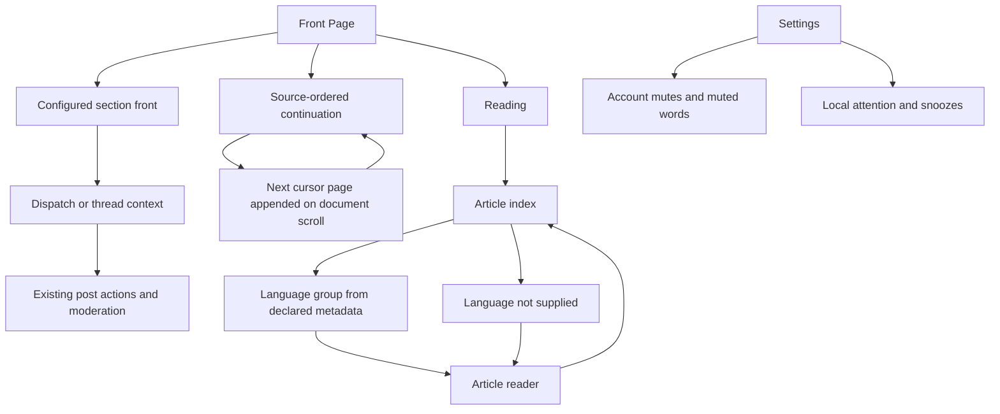

# Sitemap: Compositional News Grammar

## Navigation rules

- Front Page and configured section fronts remain publication destinations under the existing section rail.
- Each source front opens a composed section presentation; its ordered continuation stays in the same document and never gains a private scrollbar.
- Cursor success appends after existing stories, increasing the visible sheet positions without reordering prior content. A manual load-more control remains at the continuation end.
- Reading is a distinct destination. Its article index groups only on explicit language metadata and retains a “Language not supplied” group when needed.
- Selecting an article opens a separate full-width reader state. Back returns to the index and prior position; browser history should reflect the state where the existing router supports it.
- Settings owns network mutes, muted-word preferences, and Plumblines-local attention state. The front page does not expose those managers.
- Post actions and moderation remain the existing upstream behavior, reachable from the editorial story treatment.
