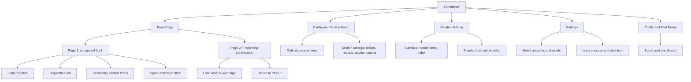

# Sitemap: Newspaper Object

The Front Page, individual Section Fronts, Reading Edition, Settings, and Profile/Post Detail have distinct tasks. The front page continues as a single document; its visible sheet boundaries are navigational landmarks rather than route transitions. Reading and Settings remain separate destinations.

## Navigation contract

- Primary rail: Front Page, configured sections, Reading.
- Utility navigation: search, notifications, messages, clippings, compose, settings.
- Page anchors: Page 1 and each appended continuation sheet; return links point to Page 1.
- Moderation settings: Settings only for persistent account/word/local attention state; contextual hide/report stays with content.
