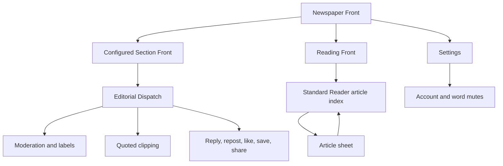
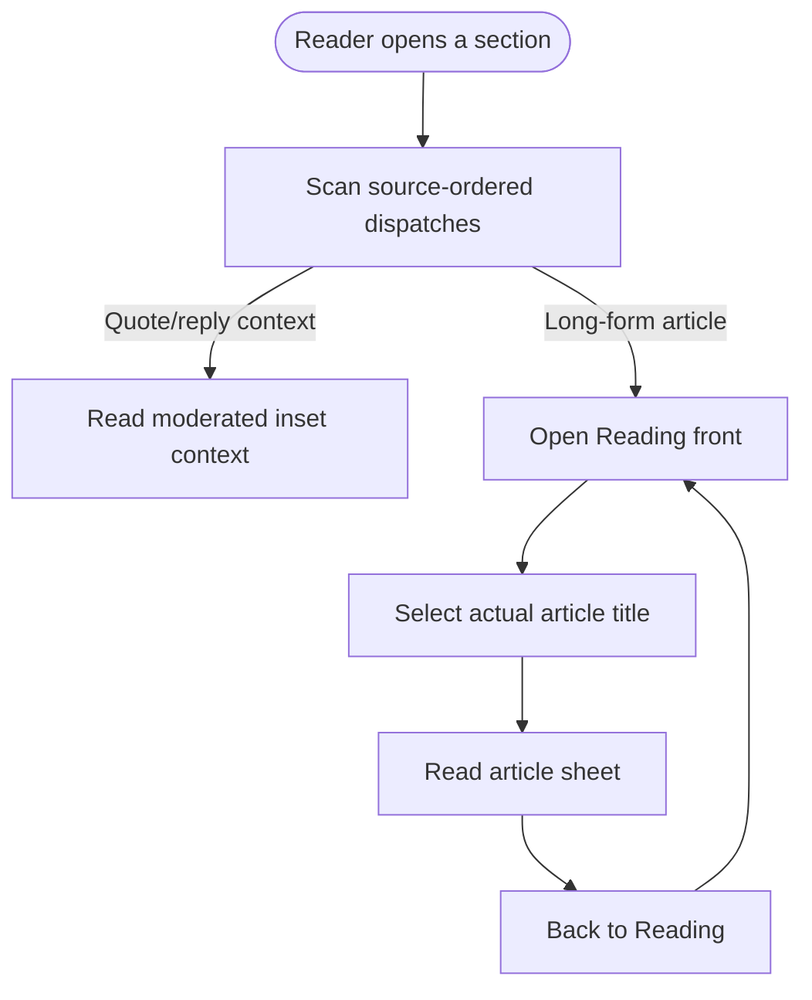

# Sitemap: Story Interiors and Reading Sheets

```mermaid
flowchart TD
  HOME["Newspaper Front"] --> SECTION["Configured Section Front"]
  HOME --> READING["Reading Front"]
  HOME --> SETTINGS["Settings"]
  SECTION --> DISPATCH["Editorial Dispatch"]
  DISPATCH --> MODERATION["Moderation and labels"]
  DISPATCH --> QUOTE["Quoted clipping"]
  DISPATCH --> ACTIONS["Reply, repost, like, save, share"]
  READING --> INDEX["Standard Reader article index"]
  INDEX --> ARTICLE["Article sheet"]
  ARTICLE --> INDEX
  SETTINGS --> MUTES["Account and word mutes"]
```

## Task flow

```mermaid
flowchart TD
  START([Reader opens a section]) --> SCAN["Scan source-ordered dispatches"]
  SCAN -->|Quote/reply context| CONTEXT["Read moderated inset context"]
  SCAN -->|Long-form article| READING["Open Reading front"]
  READING --> SELECT["Select actual article title"]
  SELECT --> SHEET["Read article sheet"]
  SHEET --> BACK["Back to Reading"]
  BACK --> READING
```
