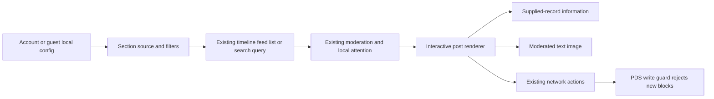

# Data flow

Sections and reading settings persist only in account-scoped local storage. PDS discovery fetches a public DID document without credentials and validates the document identity before displaying its declared HTTPS service. No custom record publish path exists.
